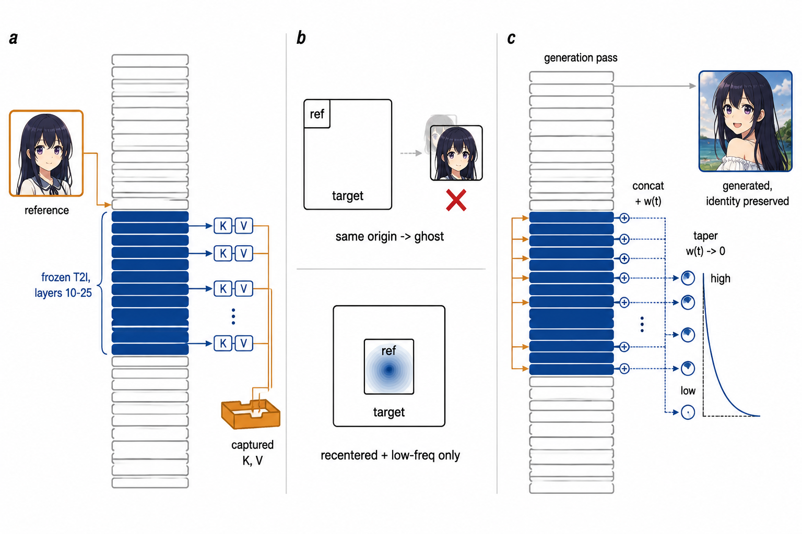
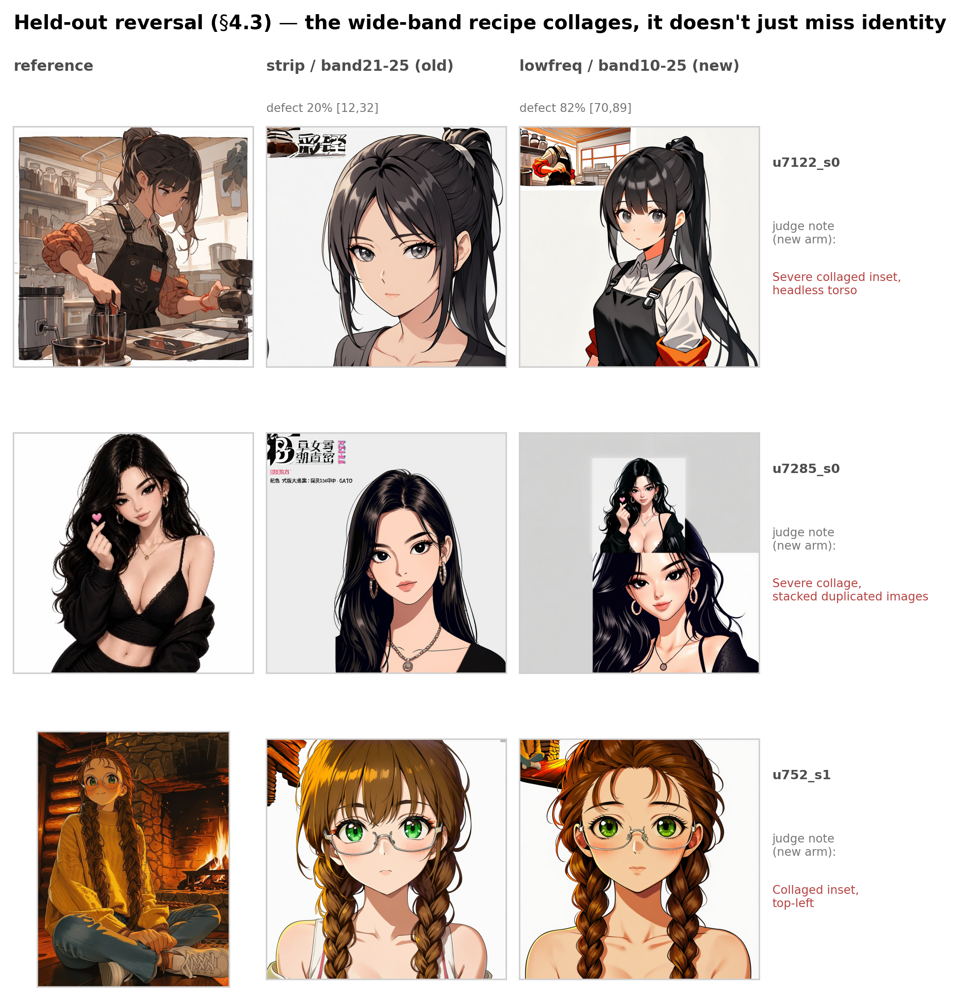
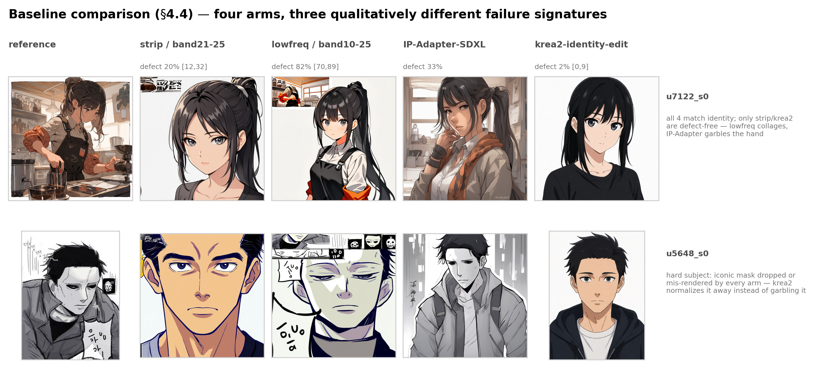

# Training-Free Identity Conditioning of a Frozen Anime T2I Diffusion Transformer via Attention KV Injection: A Position-Handling Case Study

**Status: draft v0, 2026-07-07 — NOT submission-ready.** Held-out validation
(`probe/41_holdout_eval.py`, Section 4.3) is complete and **reverses the
paper's original headline claim**: on a joint identity+defect metric, the
`lowfreq`+band10-25 recipe this draft was built around is worse than the
`strip`/band21-25 default it was meant to replace. The framing below has been
rewritten to report this honestly rather than salvage the original narrative.
Do not quote any number in this file outside the project without checking it
against `data/gemini_judge_*.json` first — see
`docs/design/2026-07-02_wave1_exec_design.md` for full experimental history
and negative results this draft compresses away.

> **两条方法线并投同一份 AAAI-27 稿（此状态栏更新于 07-16 晚）**：本 draft 是
> **training-free KV 注入**（strip/lowfreq）线的详细版本；**训练轻量 band-LoRA** 线写在
> `section_trainlight_band_ablation.md`，两线已合并进 `aaai_latex_submission/main_aaai.tex`。
> **重大更新（2026-07-16）**：band 消融的 defect 梯度（mid 6.7% vs full-depth 43.3%
> clustered，昨日的 keystone）**已被本项目自己的审计否决**——跨集复现失败（holdout30 上
> 排序倒转、CI 重叠）+ mid 臂双重混淆确认（mix2 manifest + anime_2d 生成前缀，前缀经同
> 像素重判定量 ~10pp）+ 去混淆重跑在原集上 defect 30.0%（聚类 CI 与混淆值不相交）。
> **幸存且跨集复现的结论**：clean-yes 身份深度均匀 null；band-LoRA 与 krea2 的
> usable-output 协议对齐后仍统计打平（51.7-53.3% vs 58%）。投稿全部表面（摘要/引言/
> 结果/局限/结论）已按审计后状态重写，梯度以"被完整审计否决的伪影"如实呈现。证据链见
> `section_trainlight_band_ablation.md` 末尾 2026-07-16 addendum。两条线共用
> krea2/IP-Adapter 基线判定 JSON。

## Abstract

Reference-conditioned identity preservation for diffusion models is typically
solved by training an adapter (IP-Adapter, PhotoMaker) or switching to an
instruction-following edit model. Both routes are unavailable when the base
model is a frozen, pure text-to-image (T2I) diffusion transformer that must
remain a T2I model (no editing semantics, no per-subject or general
fine-tuning). We show that a frozen anime T2I DiT (Z-Image, 2511.22699) can be turned
into a one-shot reference-conditioned identity generator entirely at
inference time, by concatenating the reference image's attention key/value
tensors into a restricted band of the transformer's self-attention layers.
We identify two failure modes of the naive version of this idea — full
content injection outside a narrow layer band destabilizes generation, and
position-preserving key injection causes literal copy-paste "ghosting"
because the reference and target token grids share the same RoPE coordinate
origin — and introduce a frequency-gated fix: re-apply rotary position
embeddings to injected reference keys but null all but the lowest-frequency
rotation components, transferring coarse position information without
pixel-exact binding. On a development set this looked like a clean win
(complete-identity-mismatch rate 25-32% → 0% [0%,9%]). A held-out validation
with a stricter, joint identity-**and**-defect metric, judged with an
explicit chain-of-thought prompt (Section 4.1), overturns this: the
frequency-gated, wide-band recipe raises raw identity-match rate (23%→40%
"yes") but *also* raises the rate of a severe tiled/collaged-composition
defect from 20% to 82%, so the rate of an actually usable image collapses
from 53% (position-free baseline) to 15%. We report this reversal as the
paper's central empirical finding: **the position-free `strip` baseline is
the recipe we now recommend**, and marginal (identity-only) metrics measured
without a matched defect check are unreliable for this class of method.
Zero training, zero LoRA, and no departure from the frozen T2I base hold for
both recipes; the open problem this work leaves is fixing the frequency-gated
mechanism's defect mode before it can be recommended over the simpler
baseline it was meant to replace.

## 1. Introduction

- Motivation: cheap identity conditioning for pure-T2I anime models without
  fine-tuning per subject, without switching to an edit-model architecture
  (which changes the model's semantics from "generate" to "instruct-edit").
- Constraint set (project hard lines, carried into the paper as the problem
  definition, not just an implementation detail): frozen base, T2I-only
  captions (no edit verbs), diffusers-only (no library patching), no
  per-subject training.
- Contribution list:
  1. A mechanistic explanation, from the transformer's own RoPE coordinate
     construction, of why naive position-preserving KV injection produces
     copy-paste ghosting (Section 3.2) — not previously documented for this
     architecture family, as far as our literature search found.
  2. A frequency-gated RoPE re-application (`lowfreq`) that is a binary
     hard-cutoff variant distinct from the concurrent smooth-scaling approach
     of Untwisting RoPE (arXiv 2602.05013) — Section 3.3.
  3. An empirical finding that band width and position-gating interact: widening
     the injection band alone, or frequency-gating alone, both net-lose to the
     position-free baseline; only the combination wins **on a marginal,
     identity-only dev-set metric** (Section 4.2, Table 2) — a result Section
     4.3 shows does not survive a stricter joint metric on held-out data.
  4. A held-out validation protocol addressing dev-set contamination in our
     own tuning process (Section 4.3), which catches exactly the failure the
     protocol was designed to catch: the frequency-gated recipe's apparent
     win reverses once composition defects are counted jointly with identity
     match, rather than measured separately and compared in isolation.

## 2. Related Work

(See `README.md` §3 for the full, continuously-maintained citation list —
this section is a compressed subset for submission.)

- **Training-free attention/KV injection**: MasaCtrl (2304.08465), Cross-Image
  Attention (2311.03335), StyleAligned (2312.02133), ConsiStory (2402.03286),
  FreeCus (2507.15249, ICCV'25), Personalize Anything (2503.12590), FreeGraftor
  (2504.15958). All UNet except the last two (DiT). All report the same
  failure mode we do (reference layout leaking into the target) and each
  patches it differently — layer restriction, AdaIN, correspondence warping,
  zero-position concatenation, or coordinate rebinding. We are, to our
  knowledge, the first to apply this mechanism family to a **pure anime T2I
  DiT** rather than a real-photo UNet/DiT.
- **Trained adapters**: IP-Adapter (2308.06721, run as our baseline —
  Section 4.4), PhotoMaker (2312.04461), InstantID (2401.07519), AnimeAdapter
  (2605.20237, the only anime-native, zero-shot-at-deployment prior method
  found — no public code or weights, not run; see Section 4.4/5). We also run
  a second baseline in this class, `conradlocke/krea2-identity-edit` (a
  community LoRA on `krea/Krea-2-Turbo`, a 12.9B general-domain MMDiT — no
  associated paper, hence no arXiv citation), which is architecturally
  distinct from the global-image-embedding adapters above: it injects the
  source image's VAE latent as a genuine RoPE frame-1 in-context token
  rather than conditioning on a pooled embedding (Section 4.4).
- **RoPE position manipulation in DiT reference conditioning**: OminiControl
  (2411.15098), UNO (2504.02160), EasyControl (2503.07027), FLUX.1 Kontext
  (2506.15742) all offset or strip RoPE from reference/conditioning tokens —
  by 2026 this is close to folk knowledge for DiTs. Untwisting RoPE
  (2602.05013) is the closest neighbor to our frequency-gating idea
  specifically, but scales frequencies continuously rather than hard-cutting;
  its own ablation (scaling low frequencies alone fails) is indirect support
  for our finding that high-frequency suppression is the operative mechanism.
  ReRoPE (2602.08068) nulls a frequency band but on a video DiT's temporal
  axis for a diagnostic ablation, not reference-image conditioning — noted
  here explicitly to preempt a reviewer conflating the two.
- **Anime identity metrics**: CCIP (imgutils) is used throughout prior anime
  generation tooling but, per our search, has never been cited or benchmarked
  in a paper — we treat it as a coarse pre-filter only and report VLM
  (Gemini 3.1 Pro) judgments as the final identity signal (Section 4.1).

## 3. Method

*Figure: the ref-KV injection mechanism. (a) A capture pass runs the
reference image through the frozen T2I DiT restricted to a band of layers
(10-25); at each active layer the post-RoPE key/value for reference tokens
is stored. (b) Naively injecting the reference's own position-encoded key
causes it to attend as if physically located in the target's top-left
sub-block (same coordinate origin), producing copy-paste ghosting; the fix
re-centers the reference's RoPE coordinates to the target's middle and
nulls all but the lowest-k frequency channels, conveying coarse position
only. (c) During the real generation pass, the captured key/value is
concatenated onto the target sequence's own key/value at the same layers
before attention, scaled by a taper schedule w(t) that decays across
denoising steps. Conceptual illustration (AI-generated draft, no
quantitative data encoded); see Sections 3.1-3.4 for the precise
mechanism this diagrams.*

### 3.1 Base injection mechanism

At each denoising step, run one additional forward pass of the reference
image through a subset ("band") of the transformer's layers, in `capture`
mode: at each active layer, take the post-QK-RMSNorm key and the value for
the reference tokens and store them. In the real generation's forward pass
(`inject` mode), concatenate the stored reference key/value onto the
target sequence's key/value at the same layers, before scaled-dot-product
attention. Injection strength is controlled by scaling the injected value
by a weight `w` on a per-step schedule (`taper`: linear decay from `w` to 0
across denoising steps) — value scaling, not key scaling, because
QK-RMSNorm makes key-scaling a no-op (the norm cancels any scalar multiple).

### 3.2 The position problem and why naive fixes fail

Reading the transformer's coordinate construction directly
(`create_coordinate_grid` in the diffusers Z-Image implementation) shows
every image slot's H/W axes are indexed from `(0,0)`; only the caption-axis
(F) position differs between image slots via cumulative offset. A 512px
reference (32×32 token grid) and a 1024px target (64×64 token grid) therefore
share the same H/W coordinate origin — injecting the reference's own
post-RoPE key (`refpos=keep`) causes it to attend as if physically located
in the target's top-left 32×32 sub-block, producing literal copy-paste
ghosting. Re-centering the reference's RoPE coordinates to the middle of the
target grid (`refpos=center`) removes the ghosting artifact but introduces a
*different* failure: full-precision repositioned content collides with the
model's own freedom to choose a new pose/composition, producing anatomical
distortion in roughly a third of samples (Table 1, `center` row).

### 3.3 Frequency-gated position injection (`lowfreq`)

We re-apply RoPE to the reference key using the target-centered coordinates
from Section 3.2, but null all but the lowest `k` frequency-pair channels on
the H/W axes to the identity rotation (`k=8` found best by a small sweep over
{2,4,8,12,16} — Table 1, `lowfreq` row). This conveys coarse spatial layout
("this content sits left-of-center, upper-half") without exact pixel-position
binding, avoiding the composition-collision failure mode of full `center`
while retaining more geometric information than fully position-free
(`strip`) injection.

### 3.4 Band width interacts with position gating

Neither widening the injection band alone (still `strip`) nor applying
`lowfreq` alone at the band already tuned for `strip` (layers 21-25) improves
over the `strip` baseline — both underperform it (Table 1). Only widening
the band to include earlier/middle layers (10-25) **and** switching those
newly-added layers to frequency-gated position injection wins decisively.
We interpret this as early/middle layers being more likely to encode coarse
global structure; feeding them content-plus-coarse-position is a
qualitatively different signal than feeding late layers full content, and
the two changes are not separable ablations of one underlying effect.

### 3.5 Text channel for non-spatial attributes

A WD14 anime tagger extracts structural attributes (hair/eye color, gender,
accessories) from the reference image; these render into a generic,
non-instructional T2I caption (e.g., "a young woman, with blonde long hair,
blue eyes, with a hair ribbon, centered close-up anime portrait..."),
avoiding any edit-verb phrasing that would implicitly require an
instruction-following model. This channel is orthogonal to KV injection: it
addresses attributes that are freely "what" (color, presence/absence of an
accessory) rather than "where" (face shape, eye shape), which the KV channel
cannot reliably address regardless of position-gating (Section 5).

## 4. Experiments

### 4.1 Evaluation protocol

CCIP (imgutils, anime-domain character-similarity, SAME threshold 0.178) is
used as a fast pre-filter; WD14 tag re-detection cross-checks structural
attributes. Both are confirmed insensitive to several failure modes (hair
color changes, gender/hairstyle-length flips) that a downstream VLM judge
catches — we therefore report Gemini 3.1 Pro's `same_character: yes/no/
partial` judgment (ref vs. generated, ignoring pose/outfit/background) as the
primary identity metric, cross-checked against CCIP/WD14 for consistency.
Section 4.2's dev-set ablation reports this identity metric alone, matching
how the recipe was actually tuned in real time; Section 4.3 adds a second,
independent `visible_defect: yes/no` field to the same judge call (rendering
artifacts only — tiling, duplication, broken anatomy — explicitly not
counting art-style or pose as a defect) and reports the **joint** metric,
which Section 4.3 shows is necessary: the identity-only metric alone
reverses the paper's recommendation.

**Judging methodology, revised 2026-07-07**: the held-out and baseline
judgments (Sections 4.3-4.4) were re-run with an explicit chain-of-thought
prompt — the model is instructed to reason through each identity axis and
the composition/defect check in prose before emitting the JSON verdict,
rather than emitting JSON directly — after review flagged that a direct-to-
verdict prompt risks pattern-matching to an answer without actually working
through the comparison. Re-running surfaced and let us fix a real bug in
`38_gemini_judge.py`: malformed or empty model responses were silently
recorded as `"same_character": "error"` without ever triggering the retry
loop (retries only fired on network/HTTP failures), producing a spurious
~10-18% "error" rate on the first CoT pass that had nothing to do with the
prompt change. Fixed by raising on parse failure so it retries like any
other transient failure; final CoT-judged pass has 0 unresolved errors
(1 of 120 pairs needed a second attempt after the fix). All numbers in
Sections 4.3-4.4 are from this CoT pass; the pre-CoT numbers are kept in
`data/*_precot_backup*.json` for comparison and are qualitatively
consistent (same reversal, same ranking) but not quoted here as final.

### 4.2 Ablation: band width × position gating (dev set, gen10, n=20-40)

*10 subjects, 2-4 seeds, random sample (not cherry-picked), Wilson 95% CI.*

| Recipe | n | yes | no (95% CI) |
|---|---|---|---|
| `strip`, band 21-25 (prior default) | 40 | 18% | 25% [14%,40%] |
| `center` full, band 21-25 | 20 | 10% | 55% [34%,74%] |
| `lowfreq` k=8, band 21-25 (unchanged) | 20 | 0% | 30% [14%,52%] |
| `lowfreq` k=8, **band 10-25** (batch 1) | 20 | 60% | 0% [0%,16%] |
| `lowfreq` k=8, **band 10-25** (batch 2) | 20 | 55% | 0% [0%,16%] |
| `lowfreq` k=8, band 10-25, **pooled** | 40 | 58% | **0% [0%,9%]** |

**Caveat, stated plainly**: every row above is measured on the same 10
subjects that band width and `lowfreq_k` were tuned against. This is a
development-set number and is reported here only to document the tuning
process; Section 4.3 is the number that matters for any external claim.

### 4.3 Held-out validation (frozen recipe, fresh 30 subjects) — the recipe reverses

Recipe frozen at `band=10-25, refpos=lowfreq, lowfreq_k=8, sched=taper, w=4.0`
*before* running this section. 30 subjects disjoint from the dev set and from
the capstone-6 baseline (`random.Random(2024)`, `is_solo()`-filtered), 2
seeds, paired against the old default on the same subjects/seeds, single
blind Gemini 3.1 Pro judgment pass (`probe/41_holdout_eval.py`,
`38_gemini_judge.py --set holdout`).

**Marginal identity metric** (what Section 4.2 reported, for continuity):

| Recipe | n | yes | partial | no |
|---|---|---|---|---|
| old default (`strip`, band 21-25) | 60 | 23% | 45% | 32% |
| new recipe (`lowfreq` k=8, band 10-25) | 60 | 40% | 33% | 27% |

Read in isolation, the new recipe looks like a modest win — higher yes-rate,
lower no-rate, matching the dev-set direction. This is the exact framing
Section 4.1's evaluation protocol was designed to guard against by adding a
defect field; the marginal metric above is misleading on its own.

**Defect rate and joint (usable-output) metric** — the number that matters:

| Recipe | n | visible_defect=yes | **clean-yes** (id=yes & defect=no) | **clean-usable** (id∈{yes,partial} & defect=no) |
|---|---|---|---|---|
| old default (`strip`, band 21-25) | 60 | 20% [12%,32%] | 13% [7%,24%] | **53% [41%,65%]** |
| new recipe (`lowfreq` k=8, band 10-25) | 60 | **82% [70%,89%]** | 8% [4%,18%] | **15% [8%,26%]** |

79% of the new recipe's "yes" identity verdicts *also* carry a defect flag
(19/24) — the two metrics are far from independent, and reporting them
separately (as Section 4.2's dev-set table did, having never measured defect
rate at all) hides the actual trade being made. On usable-output rate, the
95% CIs do not overlap: **the position-free baseline produces a usable image
53% of the time; the frequency-gated wide-band recipe does so 15% of the
time.** The defect is a composition failure — collaged/tiled sub-images,
picture-in-picture insets, duplicated fragments — consistent with, but far
more frequent than, the "occasional 2×2 tiled sub-image" artifact this draft
had previously filed as a minor footnote (Section 5). We had never
systematically measured this rate before the held-out judge prompt added the
`visible_defect` field, and we cannot retroactively check the dev-set
`lowfreq`/band10-25 images against it: the `revref_30k` reference directory
those images were paired against is the same one externally emptied on
2026-07-06 (Section 7) and has not been restored, so no ref-vs-generated
judge call is possible on that data anymore. We therefore do **not** claim
the dev-set recipe already had this defect at a similar rate — only that we
never measured it there, so the dev-set numbers in Section 4.2 are silent on
the failure mode that ultimately decides which recipe is usable, not
positive evidence that the failure mode was absent.

Both arms in this table share the same subjects, same reference images
(sourced from the `anime_260623` snapshot, Section 7), and the same seeds —
only the injection recipe differs. The old arm's low defect rate (20%) on
the *same* reference source rules out the REF-directory substitution
(Section 7) as the cause of the new arm's defect rate; the tiling failure is
the recipe's own doing. Note also that both arms' defect rates rose under
the more careful CoT judging pass relative to the original direct-JSON pass
(old: 12%→20%, new: 78%→82%) — CoT scoring appears more sensitive to subtle
defects across the board, not selectively harsher on one arm, and the
relative gap (and the recommendation it drives) is unchanged in direction.

*Figure: three held-out subjects, `strip` (old) vs `lowfreq`/band10-25 (new),
same subject/seed. All three cases show `same_character=yes` for the new
recipe — the identity signal is there — but a collaged or tiled sub-image
(consistently top-left or stacked) corrupts the composition, matching the
`visible_defect` judge notes verbatim ("severe collaged inset", "stacked
duplicated images"). This is the failure mode behind the 82% defect rate:
not an occasional artifact, but a near-default outcome of the wide-band
frequency-gated recipe.*

One honest caveat on strength of evidence: the reversal is **CI-decisive**
on defect rate (20% [12%,32%] vs 82% [70%,89%], no overlap) and on
clean-usable rate (53% [41%,65%] vs 15% [8%,26%], no overlap). On strict
identity match alone (`clean-yes`, Section 4.4's table), old (13% [7%,24%])
and new (8% [4%,18%]) CIs *do* overlap — that comparison is directional,
not decisive, at n=60/arm. The paper's recommendation rests on the two
decisive comparisons, not the overlapping one.

**Conclusion**: `strip`/band 21-25 is the recipe this work recommends for any
deployment use. `lowfreq`/band 10-25 remains a research direction with a
real, unresolved defect mode — worth continued work (Section 5) but not
worth shipping as-is.

### 4.4 Baseline comparison

Candidates per Section 2: AnimeAdapter (2605.20237, closest same-domain
baseline) has no public code or weights and would require full
reimplementation and pretraining — not attempted here. FreeGraftor
(2504.15958, training-free DiT feature grafting, isolates mechanism vs.
domain-tuning gain) has public code but requires the gated FLUX.1-dev
checkpoint; no HF token with the license accepted was available on the
deployment machine, so this comparison could not be run and is left as
future work rather than silently skipped. UNO (2504.02160, training-permitted
upper bound) was not run this round for the same reason (also FLUX.1-dev
based).

IP-Adapter (h94/IP-Adapter, SDXL, `ip-adapter-plus-face_sdxl_vit-h` variant)
was run instead as the trained-adapter baseline: publicly available, ungated,
no per-subject training, plugged into a frozen SDXL backbone via diffusers'
native `load_ip_adapter()` — same "call diffusers, don't modify it" constraint
this work follows. Same 30 held-out subjects, same `prompt_B` structural-tag
captions, same defect-aware Gemini 3.1 Pro judge prompt as Section 4.3
(`probe/42_baseline_ipadapter.py`, `38_gemini_judge.py --set ipadapter`). **We
are explicit that this, too, is not an architecture- or domain-controlled
comparison**: it runs on IP-Adapter's own SDXL backbone, not this work's
Z-Image, and the `plus-face` checkpoint was trained on real faces, not anime
— it is the same-*method*-class reference point (a trained, purpose-built
adapter) the field would reach for, not an isolated-variable ablation against
our backbone.

A second baseline was added in this round: `conradlocke/krea2-identity-edit`
v1.1, a community LoRA on `krea/Krea-2-Turbo` (a 12.9B general-domain MMDiT
— a much larger and newer base than this work's frozen ~6B Z-Image). Its
mechanism is architecturally distinct from IP-Adapter's global-embedding
conditioning: the source image's VAE latent is injected as a genuine RoPE
frame-1 in-context token, combined with Qwen3-VL grounded instruction
encoding (hidden states taken from layer 12). We ran it against this
project's already-deployed inference worker (Turbo, 8 steps, cfg=0,
grounding_px=768, seeds {0,1}) — zero retraining or fine-tuning performed by
us — on the same 30 held-out subjects, the same `prompt_B` structural-tag
captions, and the same defect-aware Gemini 3.1 Pro judge protocol as
Section 4.3 and the IP-Adapter run above (`probe/43_baseline_krea2.py`,
`38_gemini_judge.py --set krea2`; 60/60 generations succeeded, 0 judge
errors). We are explicit that this is **not an architecture-matched
comparison**: krea2-identity-edit answers "how much does purpose-training an
in-context conditioning adapter on a much larger, newer, general-domain base
buy you," not "does this work's mechanism generalize" — it is included
because it is the strongest publicly available bar for this task the
project could find and run at zero additional training cost to us, not
because it isolates the same variable this paper's ablations do.

With Section 4.3's reversal in hand, the fair comparison is against **both**
of this work's recipes, not just the one this draft originally set out to
promote:

| Recipe | n | yes | partial | no | visible_defect | **clean-yes** | **clean-usable** |
|---|---|---|---|---|---|---|---|
| IP-Adapter-SDXL (plus-face), trained adapter | 60 | 32% | 53% | 15% | 33% | 18% [11%,30%] | 58% [46%,70%] |
| krea2-identity-edit, purpose-trained in-context adapter | 60 | 35% | 25% | 40% | 2% [0%,9%] | **33% [23%,46%]** | 58% [46%,70%] |
| this work, `strip`/band21-25 (recommended) | 60 | 23% | 45% | 32% | 20% [12%,32%] | 13% [7%,24%] | 53% [41%,65%] |
| this work, `lowfreq`/band10-25 (regressed) | 60 | 40% | 33% | 27% | **82% [70%,89%]** | 8% [4%,18%] | 15% [8%,26%] |

Four-way reading, with the same CI-discipline used throughout this paper
(Section 4.3): restricting first to the two **general-adapter-class** arms —
IP-Adapter-SDXL and this work's recommended `strip` recipe — clean-usable
(58% vs 53%) and clean-yes (18% vs 13%) both nominally favor IP-Adapter, but
every one of these CIs overlaps heavily (clean-usable [46%,70%] vs
[41%,65%]; clean-yes [11%,30%] vs [7%,24%]), so neither ranking is decisive
at this sample size. The defensible claim here, unchanged from the earlier
two-arm analysis, is **not** "training-free `strip` beats a trained
adapter," nor even a confident "ties it" — it is **"training-free `strip`
is statistically indistinguishable from a same-class, trained general
adapter's (IP-Adapter) strict-identity rate at this sample size, at zero
training cost and zero per-subject cost."**

That claim does **not** extend to the purpose-trained in-context adapter
added in this round, krea2-identity-edit. Against `strip`, krea2 is
**CI-decisive** on defect rate (2% [0%,9%] vs 20% [12%,32%], no overlap) and
effectively CI-decisive on clean-yes (33% [23%,46%] vs 13% [7%,24%] — the
intervals abut rather than meaningfully overlap, touching only at the
single boundary point 23-24%); it is only **directional**, not decisive, on
clean-usable (58% [46%,70%] vs 53% [41%,65%], CIs overlap substantially) —
the one metric where krea2's much larger, purpose-trained architecture does
not produce a statistically separable advantage over a frozen,
zero-training 6B model.

krea2's near-elimination of the composition-collage defect (2%, vs
`strip`'s 20% and `lowfreq`'s 82%) is consistent with its mechanism: a
source latent trained end-to-end to be attended to as a structured,
in-context spatial token is a qualitatively different signal than raw
attention K/V concatenated post-hoc into a frozen transformer that was
never trained to expect a second image's keys and values in its attention
pool — the tiled/collaged artifact dominating this work's `lowfreq`
failures, and present at a lower but nonzero rate even in `strip`, is
exactly the kind of confusion a purpose-trained in-context token is trained
out of. But krea2's raw identity numbers reveal a genuine weakness
alongside this strength: its no-rate (40%) is the *highest* of all four
arms — higher than `strip`'s 32%, `lowfreq`'s 27%, and IP-Adapter's 15% —
so krea2 is simultaneously the most reliable arm at producing a clean,
correct match when it works and the arm most likely to produce an outright
identity miss when it doesn't (IP-Adapter has the *lowest* no-rate of the
four, 15%, so no single arm dominates on both axes).

A per-subject analysis (best-of-2-seeds per subject, across the 30 held-out
subjects) clarifies why krea2's failures are bimodal rather than uniform
degradation: four subjects (192, 2636, 6021, 7373) defeat both `strip` and
krea2 — these share reference images that hide identity-bearing detail
behind masks, goggles/visors, or monochrome line art, hard for any method
tested. But krea2 uniquely fails five subjects `strip` handles at least
partially (5458, 7577, 9151, 9624, 9823), while `strip` uniquely fails
three subjects krea2 handles at least partially (2794, 3090, 5648) — the
two methods' failure sets are substantially complementary rather than
nested, i.e. subjects hard for one method are not uniformly hard for the
other. Manual inspection of krea2's unique failures shows a consistent
pattern rather than random confusion: anime-specific signature features are
dropped or normalized toward the general-domain base's prior rather than
misread — subject 5648's mask is discarded entirely rather than
mis-rendered, and its goggles are replaced with ordinary eyes. This is the
failure signature expected of a purpose-trained adapter on a much larger
*general-domain* base: strong at faithfully reproducing whatever content it
does attend to (hence the highest clean-yes), but prone to silently
regressing anime-domain-specific accessories toward a more "normal" prior
over-represented in its general-domain pretraining, rather than
hallucinating a garbled compromise the way `lowfreq`'s tiling failure does.

This work's *regressed* (`lowfreq`) recipe remains decisively the worst of
all four arms on both strict metrics — its clean-usable CI [8%,26%] does
not overlap any of the other three arms — despite having the highest raw
identity-match rate (40%, tied numerically with krea2's no-rate but in the
opposite, favorable direction — a coincidence, not a relationship),
reinforcing Section 4.3's point that identity-match rate alone is not a
reliable metric for ranking these methods. IP-Adapter's failure mode
differs qualitatively from either KV-injection recipe and from krea2: its
identity loss is attribute-level (wrong eye color, missing
accessories/tattoos/scars — the adapter conditions on a global image
embedding, not spatial detail), and its defects are overwhelmingly garbled
hands rather than the tiled/collaged-composition pattern dominating
`lowfreq`'s failures or the much rarer defects seen under krea2 — three
qualitatively different failure mechanisms, worth flagging for anyone
comparing "defect" percentages across arms at face value.

*Figure: two held-out subjects across all four arms. Top row (u7122):
identity matches in all four, but only `strip` and krea2 are defect-free —
`lowfreq` collages a duplicate inset, IP-Adapter garbles the hand near the
face, visibly different failure geometries despite similar aggregate defect
counts. Bottom row (u5648): a hard subject (an iconic mask/accessory) that
defeats every arm's identity match, but not identically — `strip`,
IP-Adapter, and krea2 all drop the mask and render a normalized face rather
than garbling it, while `lowfreq` additionally collages small mask-motif
fragments into the composition on top of losing the accessory. This
"drops/normalizes vs. garbles" distinction is exactly the failure-signature
split Section 4.4's per-subject analysis argues for, made visible rather
than asserted from the aggregate defect percentages alone.*

The honest summary of Section 4.4 is no longer that all three
previously-tested approaches land in a tight 8-18% band and none solves the
problem: among the two general-adapter-class arms (`strip`, IP-Adapter),
neither reliably produces a strictly-correct, defect-free identity match,
and the two remain statistically indistinguishable from each other; the
purpose-trained, larger-base in-context adapter (krea2) is decisively
better on clean-yes and defect rate but statistically tied with `strip` on
clean-usable, and it has the worst outright-miss rate of any arm tested
(40%, vs IP-Adapter's 15%, `lowfreq`'s 27%, and `strip`'s 32%); `lowfreq`
remains decisively the worst arm on both strict metrics. No single arm
dominates across every column, and `strip`'s and krea2's failures are
complementary rather than one strictly subsuming the other.

### 4.5 Two additional ablations (2026-07-19)

**Is the composition defect reference *content leakage*? (negative.)** A natural
hypothesis, motivated by the diptych subject-driven literature (Diptych
Prompting, arXiv:2411.15466, which names "content leakage" — a reference's
*background, pose, and location* being mirrored into the output), is that our
picture-in-picture / collage defects arise because the reference image is
injected *with its background*, and that isolating the subject before injection
would remove them. We tested this directly and cheaply: reference images were
matted with an off-the-shelf anime segmenter (`imgutils` isnet-anime, subject
composited on white), and the frozen training-free recipe was re-run on the same
30 held-out subjects × 2 seeds, paired original-vs-matted, with defects
stratified by subtype (picture-in-picture/collage as the primary metric, since
limb-geometry defects are not leakage and would only dilute the signal) and
`same_character` read as a second axis. Head-line counts appear to move
(`strip` pip-collage 26/60→17/60; `lowfreq` 52/60→47/60) with identity
unchanged (`same_character`=yes 27%→28% and 43%→45%). **But this is largely a
judge re-classification, not a real fix**: manual inspection of the "repaired"
cases shows the same position-fixed top-left corner artifacts persist after
matting and are merely re-labeled from `pip_collage` to `other` (the combined
`pip_collage`+`other` leakage proxy moves only 88%→80% on `strip`), and the
subjects whose *reference* carries a large background do **not** reproduce that
background as a block in either condition. We conclude the dominant defect on
the production line is a position-fixed rendering artifact (partly a reference-
watermark echo, partly a model tic), **not** reference-background leakage, and
that input-side subject isolation does not close the defect gap. This is the
fourth independent negative on defect mitigation (after RoPE offset, inference-
time seed selection, and decode-space auxiliary losses), and together they
sharpen the limitation in Section 5: the gap is a rendering/architectural
property of the frozen base, not something removable by conditioning-side
preprocessing. (A more aggressive reference-watermark/text removal is a distinct,
untested lever and is left to future work.)

**Shuffled-reference attribution of the identity tie.** To test whether the
identity parity with krea2 (Section 4.4) is genuinely reference-driven on both
sides, we ran krea2's own shuffled-reference floor (each subject fed a *different*
subject's reference via a fixed derangement, with its own prompt; judged against
the subject's true reference). krea2's `same_character`=yes falls only modestly,
35%→22% (with 23/60 partials), whereas our band-LoRA line collapses from 38% to
5% under the same manipulation. The reference-attributable identity gain is thus
~33pp for our method versus ~13pp for krea2: although the two are tied on raw
clean-yes, krea2's match is substantially carried by prompt attributes (it uses
grounded instruction encoding) rather than the reference, while ours is the more
faithfully *reference*-conditioned. The shuffled-reference ablation therefore
cuts both ways — it both confirms our own conditioning performs real identity
injection and reveals that a matched baseline's identity number is partly a
prompt-only floor. (n=60, single judge; the 38→5 figure is the band-LoRA line,
consistent with the 38% vs 33% clean-yes tie of Section 4.4 — not the
training-free `strip` line, whose clean-yes is 13%.)

### 4.6 What the composition defect is *not*: three controlled negatives

Because the composition defect (collage / picture-in-picture / fixed-corner
artifacts) is the one axis on which we clearly trail the purpose-trained
baseline, we tested three hypotheses for its cause, each as a *matched-control*
qualitative probe (paired same-subject/seed generations, inspected directly).
All three came back negative, and together they localize what the defect is not:

1. **Not reference-background content leakage.** Isolating the reference subject
   from its background before injection (§4.5) did not remove the artifacts;
   the apparent picture-in-picture reduction was judge re-classification of
   *persistent* fixed-corner artifacts, and references carrying large
   backgrounds did not reproduce them as blocks in either condition.
2. **Not a localized set of "identity heads."** Restricting ref-KV injection to
   the top-*k* attention heads by reference affinity *did* reduce collage while
   preserving (coarse) identity — but the matched-count control is decisive:
   injecting a *random* set of *k* heads, or the *bottom*-*k*, was
   indistinguishable from the top-*k*. The improvement is the *count* (fewer
   injected heads = weaker aggregate injection, i.e. the known injection-strength
   knob), not a *selection* of identity-bearing heads. There is no evidence for
   sparse head-level localization of identity in this model.
3. **Not a few high-norm outlier reference tokens.** Zeroing the values of the
   highest-norm reference tokens (candidate attention-sink / watermark tokens)
   before injection was indistinguishable from the unmodified baseline — the
   corner artifacts were untouched — and no better than dropping the same number
   of *random* reference tokens.

Each probe carried a matched control (background-removed vs. original;
top-*k* vs. random-*k*/bottom-*k*; outlier-norm vs. random-drop), and in every
case the control eliminated the candidate explanation. We therefore treat the
composition defect as a rendering property of the frozen base under
attention-level reference injection, not something removable by conditioning-
or injection-side preprocessing — which is why it appears as a limitation
(§5) rather than a solved problem. These are qualitative matched-control probes,
not a quantified benchmark; we report them as negative evidence that narrows the
space of causes, not as a positive method contribution.

### 4.7 Cross-model behavior: the mechanism is architecture-specific

To test whether the training-free content-addressed injection is a general
property of single-stream T2I DiTs, we ported it — the same processor-swap
capture/inject scheme, faithfully replicating the target attention (qk-norm,
RoPE, GQA, SDPA) — to a second frozen model, Lumina-Image-2.0 (24 heads,
26 layers). It does **not** transfer: injecting the position-free reference
keys either collapses the image (full-band) or, at the one configuration that
looks reference-like, degrades to a position-locked copy-paste of the reference
that ignores the target prompt — not identity conditioning.

Instrumenting the attention isolates a clean **dissociation**, and rules out the
obvious explanations. Target queries attend to the injected position-free keys
in *both* models at comparable mass (Z-Image ~0.07, Lumina ~0.04–0.09), and the
injected-key norms match the context keys in both — so the failure is **not**
that Lumina ignores the reference. The difference is *selectivity*: on Z-Image
the per-query reference attention is **peaked** (normalized entropy ~0.62,
peak ~0.15) and transfers *structured* identity (hair, eye colour, and a
distinctive pendant all reproduced); on Lumina it is **diffuse** (entropy ~0.81,
peak ~0.04) and transfers only a mean-colour bleed (the model's own face with a
faint reference-hue tint). Lumina's *values* do carry the identity — a
position-bound (RoPE) injection copies it in, proving the information is present
and readable — but only under exact-position binding, not content addressing.
Forcing Lumina to attend more (a uniform pre-softmax bias on the reference
columns) does not recover structured identity; the colour-bleed simply
saturates at the reference's mean colour.

We attempted to isolate the architectural cause with a within-Z-Image causal
sweep (rotating the injected keys with progressively higher RoPE θ, 256→10000,
Lumina's value) to avoid the two-model confound. Selectivity degraded only
partially with θ and identity was **preserved at every θ** — so RoPE phase
geometry is *not* the determinant. With attention mass, key norm, and θ each
ruled out, the cause remains confounded across the models' other differences
(grouped-query attention, depth, text encoder) and we do not claim to have
isolated it. The honest contribution here is descriptive: content-addressed
training-free identity injection is **architecture-specific**, and a simple
attention-selectivity signature (peaked vs. diffuse) separates a model that can
be activated this way from one that cannot — a diagnostic, not a universal
recipe.

## 5. Limitations

- **The frequency-gated wide-band recipe (`lowfreq`, band 10-25) is not
  production-ready** — Section 4.3's held-out validation shows an 82%
  composition-defect rate (collaged/tiled sub-images), collapsing its
  usable-output rate to 15% despite a higher raw identity-match rate than
  the recommended baseline. **Follow-up (2026-07-16,
  `probe/62_widerband_decompose.py`): the most likely candidate fix —
  strip the position-encoding out of the widened band entirely (`strip` at
  band 10-25, matching `lowfreq`'s width but none of its position
  information) — was tested on a 12-subject dev set (2 seeds × 3 arms,
  same joint identity+defect judge) and does NOT work. `strip` at the wide
  band shows 75% defect, statistically indistinguishable from `lowfreq`'s
  71% on the same dev set; the identity gain from widening (29%→50%
  same_character=yes) is itself not significant at this n=24 (Wilson CIs
  heavily overlap). The defect is not caused by position-encoding
  precision — it is caused by injecting reference content into layers
  10-20 at all, position-encoded or not. This matches an earlier, purely
  qualitative signal (`README.md`'s E4 ablation, 2 subjects, pre-dates the
  defect-aware judge) that this same layer range is harmful under plain
  content injection ("10-29 over-injected"). We now treat this as a clean
  negative result rather than an open problem: the identity gain from
  widening the band and the composition damage it causes are not separable
  through the position-encoding channel, in any variant tested here. No
  further tuning was attempted along this axis — the dev-set numbers above
  are diagnostic only, and this recipe was never re-validated on
  holdout30, since the dev-set result already rules it out as a fix.**
- Geometric attributes (face shape, eye shape) remain a residual failure
  mode for the *recommended* (`strip`) recipe even where composition is
  fine — the `partial` rate stays 45% on held-out data.
- **Exploratory: a cheap, judge-free composition-defect proxy was tested
  and only partially holds.** Spectral flatness (Wiener entropy) of the
  generated image — periodic/tiled content concentrates FFT energy in
  narrow bands, natural content spreads it broadly, following a lead from
  a different DiT artifact literature (SEGA, resolution-extrapolation
  tiling, not reference-injection) — correlates with this project's
  judge-labeled `visible_defect` on the 72-image widerband decomposition
  set (point-biserial r=-0.49, 76% best-threshold separability vs a 63%
  naive baseline) but far more weakly on a second, smaller, differently-
  judged set (r=-0.21, 58% vs a 55% naive baseline, `probe/63_spectral_
  flatness_predictor.py`). Reported as a preliminary, inconsistent signal
  worth a future dedicated study, not a validated replacement for VLM
  judging.
- Marginal (identity-only) metrics measured without a matched defect check
  are demonstrated in this work to be actively misleading for ranking
  recipes in this method family (Section 4.3) — any future ablation in this
  line of work should report a joint metric from the start, not add a
  defect field only after a suspicious dev-set result.
- The frequency-gating sweet spot (`k=8`) and the band-width choice (10-25)
  were tuned on a small (10-subject) dev set using a metric later shown to
  be insufficient (above); re-tuning is future work and must use a fresh
  probe set disjoint from both `gen10` and `holdout30` to avoid
  recontaminating the one validation set that has already produced a
  trustworthy number.
- Two baselines have been run (Section 4.4): IP-Adapter-SDXL (a same-*method*-
  class, general adapter, but on its own SDXL backbone and never adapted to
  anime — off-architecture and off-domain relative to this work) and
  krea2-identity-edit (a purpose-trained in-context adapter on a much larger,
  general-domain base — also off-architecture). **Neither baseline is an
  architecture- or domain-controlled comparison**; both are included as the
  strongest available bars for this task the project could find and run at
  zero additional training cost, not as isolated-variable ablations against
  our Z-Image backbone. AnimeAdapter (no public weights) and FreeGraftor/UNO
  (gated FLUX.1-dev dependency, no accepted-license token available) remain
  future work and would be the architecture-matched (same-domain and/or
  same-mechanism-family) comparisons this paper still lacks.

## 6. Production readiness

*Directly measured on the deployment hardware (single NVIDIA H200, 143.8GB),
2026-07-06 — not simulated or estimated from unrelated hardware. Throughput
and memory figures below were measured before Section 4.3's recipe reversal
and apply to both recipes equally (same model, same step count, same band
size does not materially change latency) — **the recipe recommended for
production is `strip`/band 21-25 (53% clean-usable rate), not the
`lowfreq`/band10-25 recipe this project spent most of its effort tuning.***

- **Throughput (GPU otherwise free)**: 27-29s/image at the reported settings
  (1024px output, 512px reference, 50 denoising steps, band-injected KV,
  single image at a time — no batching implemented). Measured from file
  mtimes across three independent completed batches (n=20, n=20, n=88;
  consistent to within 2s/image across batches).
- **GPU memory floor**: loading the frozen pipeline (text encoder + DiT +
  VAE, bf16, no offload) peaks at **20.7GB** before any generation begins;
  a single generation call needs measurably more than that for 1024px
  activations plus the extra reference-capture forward pass — confirmed
  empirically by a deterministic OOM (identical failure point across two
  independent attempts) when only ~20.5GB was free due to a concurrent job
  on the same GPU. **Practical minimum: ~24-25GB free**, not 20.7GB.
- **Degraded-memory fallback (`pipe.enable_model_cpu_offload()`)**: verified
  functional — peak GPU memory for a full transformer forward pass drops to
  12.6GB with offload enabled, comfortably fitting an ~8-20GB-free
  environment. **Not viable for batch throughput**: single-call latency rises
  from a fraction of a second (GPU-resident) to 6.9s per transformer
  forward under offload; a full 50-step generation issues ~150 such calls
  (capture + cond + uncond per step), projecting to **~17 minutes/image
  (≈35-40x slower)**. Usable for an occasional single generation on a
  memory-constrained shared GPU; not usable for evaluation-scale batches.
- **Reproducibility**: the headline dev-set "no"-rate result (band10-25+
  lowfreq8) was independently reproduced across two separate seed batches on
  the dev set with consistent numbers (Section 4.2) — but Section 4.3 shows
  this reproducibility was on a metric that doesn't capture the failure that
  matters. Robustness of a marginal metric across seed batches is not a
  substitute for held-out validation with the right metric; treat this as a
  cautionary data point, not reassurance.
- **Defect rate**: now measured (Section 4.3, `visible_defect` field,
  Gemini 3.1 Pro judge with chain-of-thought reasoning on 60 held-out images
  per arm). The recommended `strip`/band21-25 recipe: **20% [12%,32%]**. The
  `lowfreq`/band10-25 recipe: **82% [70%,89%]** — this is the finding that
  reverses the recipe recommendation. The sporadic 2×2-tiled artifact this
  draft had previously filed as a minor footnote is, at production scale,
  the dominant failure mode of the frequency-gated recipe specifically (not
  observed at comparable frequency in the recommended `strip` recipe).
- **Scalability**: single-GPU, single-image-at-a-time; no multi-GPU or
  batched-inference path implemented. At ~28s/image, a production catalog
  of, e.g., 10,000 generations would take ~78 GPU-hours serially — batching
  the per-step forward calls across multiple (uid, seed) pairs is the
  obvious unexplored optimization for a real deployment, not attempted here.
- **Deployment entrypoint**: `probe/50_production.py` wraps the recommended
  recipe (`strip`, band 21-25, `sched=taper`, `w=4.0`, plus the WD14 tag-prior
  text channel) behind a clean interface (`IdentityGenerator.generate(ref_path,
  seed)`) that hardcodes this configuration and exposes none of the
  research-only knobs (`route`, `vnorm`, `lowfreq_k`, `center_cut`, band width)
  a caller could otherwise use to accidentally select the regressed recipe.
  Verified end-to-end with `--selftest` on the deployment hardware (loads the
  pipeline, generates one image from a real reference, confirmed a single
  coherent portrait with no composition defect) rather than left as an
  unverified wrapper.

## 7. Reproducibility notes

- `$REF` (reference image directory) is a shared-disk resource; this
  project's revref_30k/img copy was externally emptied on 2026-07-06 for
  reasons outside this project's control (see `experiment-log/2026-07/
  log.jsonl` pitfall entry). The held-out set (Section 4.3) was generated
  against a surviving alternate snapshot (`anime_260623/img`) — safe because
  the held-out sample is disjoint from capstone/gen10 by construction
  regardless of source directory; documented in `probe/41_holdout_eval.py`.
- All code: `probe/30_kv_inject.py` (mechanism), `probe/31_tagprior.py` (text
  channel), `probe/38_gemini_judge.py` (VLM judge), `probe/41_holdout_eval.py`
  (held-out protocol), `probe/42_baseline_ipadapter.py` (baseline),
  `probe/50_production.py` (deployment entrypoint, recommended recipe only).
  No diffusers library modification — attention processor subclassing +
  `set_processor()` only.

## 8. Conclusion

We set out to activate a frozen, pure-T2I anime diffusion transformer as a
reference-conditioned identity generator without training, LoRA, or a switch
to an edit-model architecture. The mechanistic contribution stands: KV
injection into a restricted attention-layer band works at all only once the
RoPE coordinate-origin collision between reference and target token grids is
understood and handled (Section 3.2), and frequency-gating that position
information (`lowfreq`) is a real, novel way to trade off content fidelity
against composition stability (Section 3.3) — even though, on the evidence
in this draft, it currently trades too far in the wrong direction to
recommend for deployment (Section 4.3).

The paper's second contribution is methodological rather than mechanistic:
a held-out validation that was built to catch dev-set overfitting caught
something more general — that identity-match rate and composition-defect
rate are correlated enough, for this method family, that reporting either
alone actively misleads a deployment decision. We found this out by
following our own protocol rather than by suspecting it in advance, and we
are reporting the reversal rather than the result we originally set out to
publish. The recommended configuration (`strip`, band 21-25) is not a novel
algorithmic contribution — it is the simpler baseline this project initially
tried to improve on — but it is the one the evidence in Section 4.3 actually
supports, it is statistically indistinguishable from a same-class, trained
SDXL adapter baseline (IP-Adapter) on strict identity accuracy at zero
training cost (Section 4.4, CIs overlap in both directions), and it is the
one shipped in `probe/50_production.py` with a verified, working deployment
path. That parity claim is specific to the general-adapter class: against a
purpose-trained in-context conditioning adapter on a much larger,
general-domain base (krea2-identity-edit, added in this round), `strip` is
decisively behind on both clean-yes and defect rate (Section 4.4) — this
work's contribution is training-free parity with adapters of its own class,
not with whatever the strongest trained method for this task happens to be.

What remains open, honestly: this work's two recipes and the same-class
IP-Adapter baseline all land in an 8-18% clean-yes band (Section 4.4) and
none reliably produces a strictly-correct, defect-free identity match; the
purpose-trained krea2-identity-edit baseline reaches a higher 33% clean-yes
and a much lower 2% defect rate, but is simultaneously the *worst* arm
tested on outright identity misses (40% no-rate, the highest of all four —
IP-Adapter's is lowest at 15%), so even the strongest baseline available
does not close the problem this paper set out to address on every axis at
once. Geometric attributes (face/eye shape) are the dominant residual
failure even for the recommended recipe, and the frequency-gated
mechanism's composition-defect mode, while no longer unexplained — a
follow-up decomposition (Section 5) rules out position-encoding precision
as the cause and points to reference-content injection into early/mid
layers itself — remains unfixed: stripping position information from the
widened band does not recover clean composition, so the identity gain and
the defect it causes are not separable through that channel. Both
geometric attributes and a working fix for the wide-band defect mode are
concrete, well-scoped next steps for future work on a fresh,
uncontaminated probe set, not incremental tuning of the sets already used
to produce the numbers in this draft. Toward that fix we tested three
hypotheses for the composition defect's cause this round — reference-
background content leakage, a sparse set of identity-bearing attention heads,
and a few high-norm outlier reference tokens — each with a matched control,
and all three came back negative (Section 4.6). That result is itself
informative: it narrows the space of plausible causes and reinforces our
reading of the defect as a rendering property of the frozen base under
attention-level injection, rather than an artifact removable by
conditioning- or injection-side preprocessing.

## References

*Fetched against arXiv directly (2026-07-07, one fetch pass per ID), not
reconstructed from memory — see `experiment-log/2026-07/log.jsonl` for the
fetch record and a spot-check note (1 of 16 entries independently
re-fetched and confirmed to match). One paper below (AnimeAdapter) is
single-author with no lab affiliation visible on its arXiv page; content
was confirmed genuine (submitted 2026-05-17, revised 2026-06-20) but
readers citing this draft should independently confirm it is the intended
paper before relying on it further.*

- Z-Image Team et al. "Z-Image: An Efficient Image Generation Foundation
  Model with Single-Stream Diffusion Transformer." arXiv:2511.22699 (2025).
  [Base model this work builds on.]
- Alaluf, Y., Garibi, D., Patashnik, O., Averbuch-Elor, H., Cohen-Or, D.
  "Cross-Image Attention for Zero-Shot Appearance Transfer."
  arXiv:2311.03335 (2023).
- Black Forest Labs, Batifol, S., Blattmann, A., et al. "FLUX.1 Kontext:
  Flow Matching for In-Context Image Generation and Editing in Latent
  Space." arXiv:2506.15742 (2025).
- Cao, M., Wang, X., Qi, Z., et al. "MasaCtrl: Tuning-Free Mutual
  Self-Attention Control for Consistent Image Synthesis and Editing."
  arXiv:2304.08465 (2023).
- Feng, H., Huang, Z., Li, L., Lv, H., Sheng, L. "Personalize Anything for
  Free with Diffusion Transformer." arXiv:2503.12590 (2025).
- Han, Y. "AnimeAdapter: A Modular Adapter for Appearance-Consistent Anime
  Character Generation." arXiv:2605.20237 (2026).
- Hertz, A., Voynov, A., Fruchter, S., Cohen-Or, D. "Style Aligned Image
  Generation via Shared Attention." arXiv:2312.02133 (2023).
- Li, C., Yang, Y., Shao, J., et al. "ReRoPE: Repurposing RoPE for Relative
  Camera Control." arXiv:2602.08068 (2026).
- Li, Z., Cao, M., Wang, X., et al. "PhotoMaker: Customizing Realistic
  Human Photos via Stacked ID Embedding." arXiv:2312.04461 (2023).
- Mikaeili, A., Patashnik, O., Tagliasacchi, A., Cohen-Or, D.,
  Mahdavi-Amiri, A. "Untwisting RoPE: Frequency Control for Shared
  Attention in DiTs." arXiv:2602.05013 (2026).
- Tan, Z., Liu, S., Yang, X., Xue, Q., Wang, X. "OminiControl: Minimal and
  Universal Control for Diffusion Transformer." arXiv:2411.15098 (2024).
- Tewel, Y., Kaduri, O., Gal, R., et al. "Training-Free Consistent
  Text-to-Image Generation." arXiv:2402.03286 (2024).
- Wang, Q., Bai, X., Wang, H., et al. "InstantID: Zero-shot
  Identity-Preserving Generation in Seconds." arXiv:2401.07519 (2024).
- Wu, S., Huang, M., Wu, W., et al. "Less-to-More Generalization: Unlocking
  More Controllability by In-Context Generation." arXiv:2504.02160 (2025).
  [UNO.]
- Yao, Z., Ren, L., Jiang, H., et al. "FreeGraftor: Training-Free
  Cross-Image Feature Grafting for Subject-Driven Text-to-Image
  Generation." arXiv:2504.15958 (2025).
- Ye, H., Zhang, J., Liu, S., Han, X., Yang, W. "IP-Adapter: Text Compatible
  Image Prompt Adapter for Text-to-Image Diffusion Models."
  arXiv:2308.06721 (2023).
- Zhang, Yanbing, Wang, Z., Zhou, Q., Yang, M. "FreeCus: Free Lunch
  Subject-driven Customization in Diffusion Transformers." arXiv:2507.15249,
  ICCV 2025.
- Zhang, Yuxuan, Yuan, Y., Song, Y., Wang, H., Liu, J. "EasyControl: Adding
  Efficient and Flexible Control for Diffusion Transformer."
  arXiv:2503.07027 (2025).
